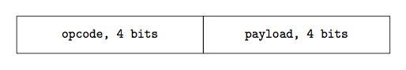
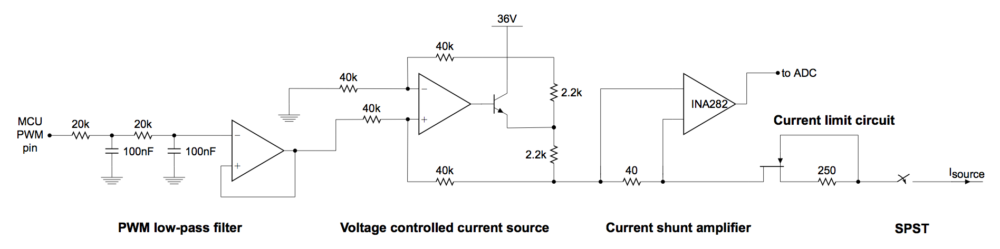
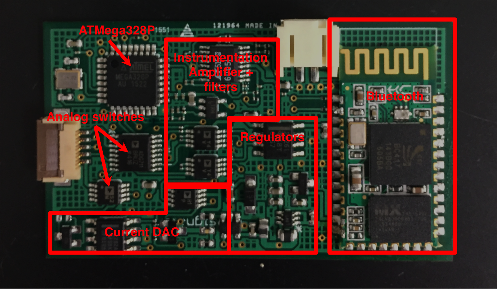
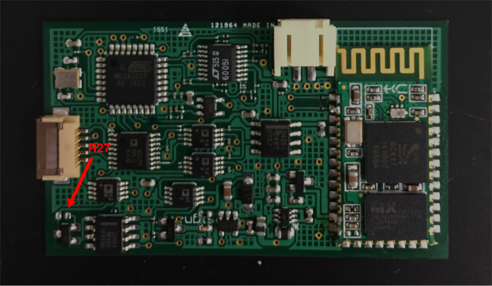

# Iontophoresis + Electrolyte Board Documentation

## Table of Contents
1. [What's in here?](#what)
2. [How to use the board](#how)
3. [Board Architecture](#boardarch)
4. [Physical board layout](#replace)
5. [Firmware and command spec](#command)
6. [Programming instructions](#program)

## What's in here? <div id='what'/>

This folder contains the board design and all of the supporting information for ordring more copies of the iontohphoresis + electrolyte sensing board. It also conatains the firmware for the board, and the datasheets for all of the components.

* **electrolyte_board_datasheets** contains the datasheets for all of the components
* **electrolyte_r3_orderfiles** contains the files needed to order and auto-assemble another round of the iontophoresis + electrolyte board. Included are the gerber files, as well as the centroids file and the Bill of Materials.
* **electrolyte_firmware_FINAL** contains the firmware for the board
* **electrolyte_eaglefiles** contains the Eagle CAD files for the board design. The associated libraries are found in the parent folder under **../eagle_libs**.

## How to use the board? <div id='how'/>

### Supplying power

The board is powered off of a single 3.7V battery, or by a power supply with a minimum output voltage of around 3.5V. **Take care to not let the battery voltage fall too far, as one of the switching regulators on the board has the tendency to heat up a lot if its input voltage is too low.** The current draw on a 4V power supply should be around 0.1A. The pinout for the battery connector is shown below:


### Connecting to Bluetooth

The board can be connected to using Bluetooth (both the GetBlue app and the custom app should work). The baud rate is 9600, and this cannot be changed. Data should be streaming out of the board as soon as a connection is made. The default pairing password for these Bluetooth modules is 1234.

**When trying to control the board using the GetBlue app, make sure that the output of GetBlue is hexadecimal.**

### Using Bluetooth commands

The board receives 8-bit commands over Bluetooth. The baud rate is 9600. When transmitting Bluetooth commands make sure that the commands are sent as bytes or hex values. Sending data as a string will be misinterpreted. The commands have format



The opcode determines what the command is, and the payload is a 4-bit number containing data. 

The board has two modes, sensing mode and current mode:

#### Sensing mode

In sensing mode, the board continuously dumps out sensor readings and current values in text string lines with the format

```
SensorCh1,SensorCh2,Current delivered,Current register
```

In this mode, the sensing switches are closed, enabling sensing, and the iontophoresis switches are open, for safety. The sensor readings are valid, the current delivered should be near zero, and current register should be exactly zero. The sensor readings are given in millivolts (mV), and the current delivered reading is given in microamps (uA).

#### Current mode

In current mode, the board continuously dumps out current values and placeholders for sensor readings in the format

```
x,x,Current delivered,Current register
```

In this mode, the sensing switches are open, disabling sensing, and the iontophoresis switches are closed. The current delivered is proportional to the 8-bit current register value. The current delivered reading is given in microamps (uA).

#### Bluetooth command specifications

Name                                   |  Hex   | Function
:-------------------------------------:|:------:|:-------------------------:
DISABLE\_IONTOPHORESIS                 |  0x4   | Disables iontophoresis, puts the board back into sensing mode.
ENABLE\_IONTOPHORESIS\_INCREMENT\_BY   | 0x5    | Adds the payload bits to the iontophoresis PWM value. Has overflow protection. Puts the board into iontophoresis mode automatically.
ENABLE\_IONTOPHORESIS\_DECREMENT\_BY   | 0x6    | Subtracts the payload from the iontophoresis PWM value. Has underflow protection. Takes the board into sensing mode automatically if PWM value reaches 0.

### Which channel is which?

Looking down from the top, with components facing up:


## Board Architecture <div id='boardarch'/>

### Voltage channels

The board has two voltage sensor channels. The analog supply voltage VDDA is 5V. The voltage sensor channels have the following architecture.


The frontend instrumentation amplifier is an Analog Devices AD8422, which was chosen specifically for its low input bias current and corresponding very high input impedance. The - terminal of the instrumentation amplifier is "floating", and is held to near 2.5V by a 10k resistor. This resistor was chosen empirically, and is large enough to be swapped by hand (described later). The reference terminal of the instrumentation amplifier is held to 2.5V to center the output of the instrumentation amplifier around 2.5V (i.e. a 0V difference across the sensor will lead to an output of 2.5V at the instrumentation amplifier). The gain resistor is chosen to be 5k, for an approximate voltage gain of 5.

The second stage of the circuit consists of two cascaded Sallen-Key low-pass filters. The passives are set such for a fourth-order low pass filter with the cutoff frequency set at 1Hz. The op-amps for the filters were chosen to be LT6005 quad general-purpose op-amps, chosen mainly for low power consumption and small size. The output of the second stage is connected directly to one of the channels of the ATMega328P ADC.

The switches placed in front of the instrumentation amplifer input terminals are ADG711 analog switches. **These switches are required to be in the OPEN state when iontophoresis is being run, to eliminate the risk of skin burns through the sensing electrodes**. The ADG711 was chosen for its ultra-low source-drain leakage current, which is necessary for the sensors to function properly.

### Power distribution

The overall system is powered off of a single 3.7V lithium ion battery. The following figure shows the power distribution for the system:


* An LTC3525-5 switching regulator is connected to the battery, and outputs 5V. This regulator is used to power both the analog components and the digital components.
* One TLE2426 rail-splitter. This is connected to the output of the 5V 
voltage regulator to provide virtual ground at 2.5V.
* A 3.3V LDO regulator is connected to the battery, and is used to power the Bluetooth module.
* An LMR64010 boost regulator is connected to the battery, and the feedback resistors are set such that the component outputs +40V for the iontophoresis power supply.

### Iontophoresis current source

The iontophoresis current source consists of a current DAC controlled by a PWM voltage output from the microcontroller. The overall schematic for the iontophoresis current source is shown below:



The PWM output from the microcontroller is passed through a second order low pass filter and then buffered. This serves to convert the PWM wave into its DC average value, and acts as a low-frequency voltage DAC for driving the current DAC. 

The difference amp and output BJT act as a voltage-controlled current source. The arithmetic demonstrating this is worked out in currentsource.pdf.

At the output of the current source, a high-side shunt amplifier based on the INA282 is used to monitor the current in real time. The output of the INA282 is connected to one of the channels of the microcontroller ADC, and is used to make sure that the true output of the current source circuit is close to its programmed value.

A current-limiting circuit is placed after the shunt amplifier, consisting of the MMBF5457 JFET and a series resistor. To raise the current limit, this resistor's value can be set lower (i.e. around 250 Ohm). To lower the current limit, the resistor's value can be set higher (up to around 750 Ohm).

Lastly, an analog switch is placed after the current-limiting circuit, to ensure that current can be fully shut off and to ensure that the iontophoresis circuit does not affect the sensors. The switch was chosen to be an ADG5401, because of its large range of supply voltages (up to 40V). Note that the node at the output of the iontophoresis circuit can swing up as high as around 36V with an open circuit load.

The current DAC can output around 1.2 mA for a wide range of physiological load resistances.

### Bluetooth

The Bluetooth module is an HC-06. These particular modules are quite common among hobbyists, and can be easily obtained off of Amazon. The Bluetooth modules enter bypass mode as soon as a connection is made, so nothing clever needs to be done in the ATMega328P firmware to get the Bluetooth module to work. The baud rate is 9600.

## Board layout <div id='replace'/>

The overall board layout is shown below:



### User replaceable parts

* The Bluetooth module must be hand-installed. The HC-06 Bluetooth module usually comes soldered to a larger baseboard, and you must first desolder the module from the baseboard before installing it onto the iontophoresis + electrolyte board.
* Resistor R27 is the resistor used to set the current limit. By default, this resistor is around 250 Ohm, but can be raised higher (up to around 750 Ohm) for a lower current limit. 



## Firmware and command spec <div id='command'/>

The commands for controlling the electrolyte board over Bluetooth are described in the document **electrolyte_bt_commands/bluetooth_spec.pdf**. Note that the commands consist of two hexadecimal digits. The first hexadecimal digit corresponds to an opcode, and the second hexadecimal digit usually corresponds to an immediate.

The firmware is written like a finite-state-machine. The state variables are
* `iontophoresisStatsuBits`, corresponding to a bitmask determining whether iontophoresis is enabled or not. This state variable affects the states of the switches.
* `measurementStatusBits`, corresponding to a bitmask determining what ADC values to read back, if any.
* `iontophoresisCurrentValue`, corresponding to the 8-bit number (0-255) proportional to the amount of iontophoresis current that should be delivered.

The inputs to the FSM are the commands.

## Programming instructions <div id='program'/>

There are six header pads directly underneath the microcontroller. **Flipping over the board**, and placing it in the orientation described in the image on the left,

Board bottom pinout                             |  Sparkfun Programmer
:----------------------------------------------:|:-------------------------:
  |  

connect the pins of the programmer to the correspondingly labeled pads. **Note that the layout of the programmer pins is different from that of the Eric4.0.** You will most likely have to solder wires to the pads on the amplifier board to achieve this. I suggest using female jumper wires to connect the programmer to these wires. The image on the right shows the pinout of the Sparkfun programmer board.

Open up the Arduino IDE, and make sure the following things are set:
* Board is set to "Arduino Pro" or "Arduino Pro Mini"
* Programmer is USBtinyISP
* Processor is set to ATMega328, 5V 16MHz

If you are programming a board for the very first time, make sure you run "Burn the Bootloader" or else the code won't work. This seems to be the most foolproof way to make sure that the fuses are set to the correct values.

Then, from the Arduino IDE, you can click "Upload using programmer" to put the code onto the microcontroller.

Alternatively, if you have platformio and GNU Make installed, you can run
```
make
```
to compile the code and
```
make impact
```
to copy the code onto the microcontroller. **I have not figured out how to burn fuse values through platformio, so you're going to have to open up the Arduino IDE to do that.**
