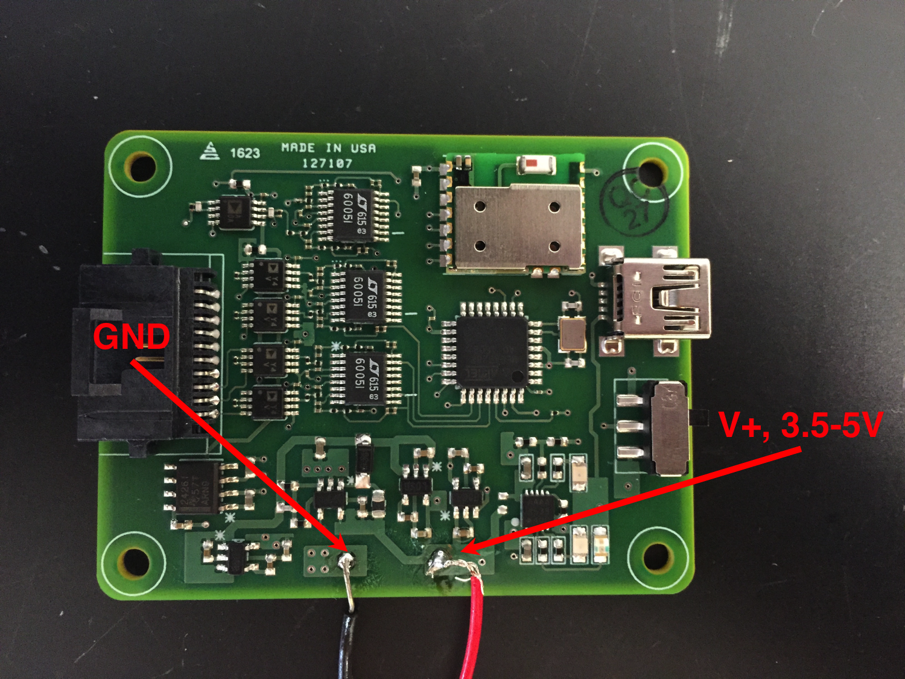
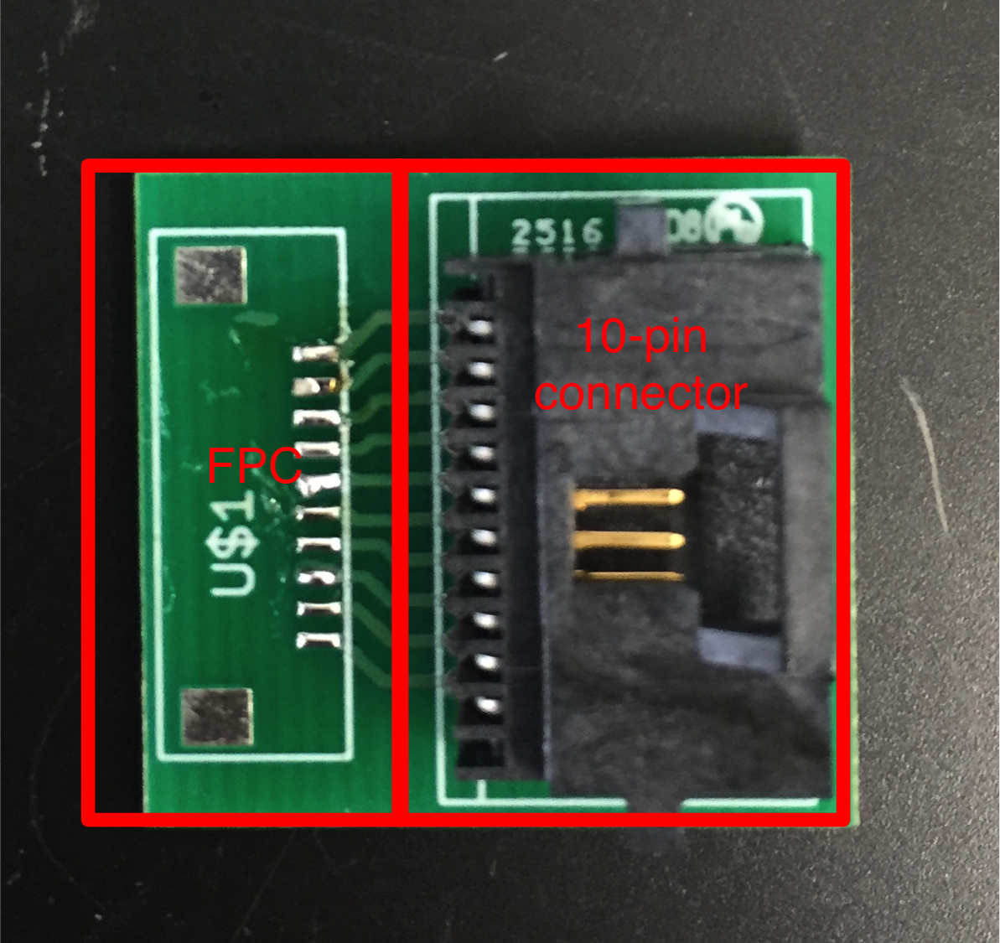
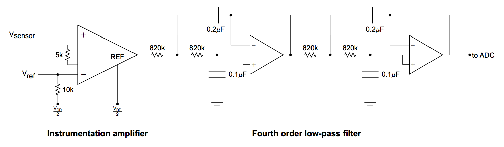
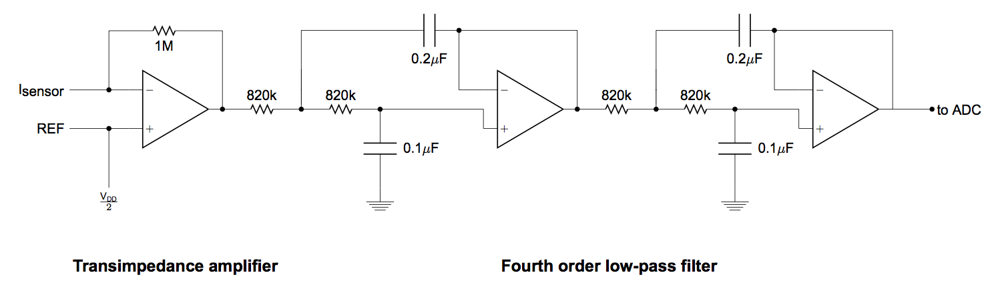
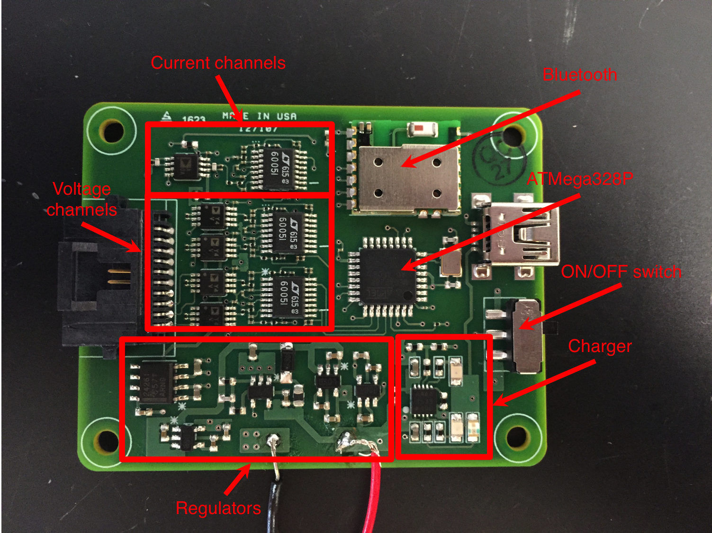
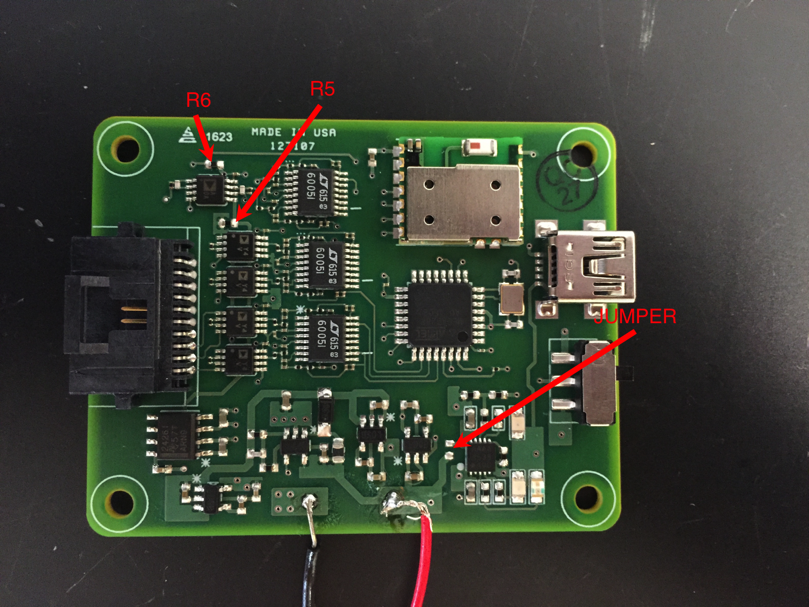

# Eric4.0 Documentation

## Table of Contents
1. [What's in here?](#what)
2. [How to use the board](#how)
3. [Transfer board](#transfer)
4. [Amplifier Board Architecture](#boardarch)
5. [Physical board layout/Parts to replace](#replace)
6. [How to program the ATMega328P](#program)
7. [TODO list](#todo)

## What's in here? <div id='what'/>

This folder contains the board design and all of the supporting information for ordering more copies of the Eric4.0. It also contains the firmware for the board, and datasheets for all of the components.

* **datasheets** contains the datasheets for all of the components used in the Eric4.0
* **files_for_order** contains the files needed to order and auto-assemble another round of the Eric4.0. Included are the gerber files, as well as the centroids file and Bill of Materials.
* **firmware** contains the firmware for the board
* **fullboard_eaglefiles** contains the Eagle CAD files for the main amplifier board design. The associated libraries are found in the parent folder under **../eagle_libs**.
* **transferboard_eaglefiles** contains the Eagle CAD files for the transfer board. This board is a simple board that breaks out the cable connector on the main amplifier board into a 10-pin 1mm FPC connector.
* **gerber_transfer** contains the Gerber files for the transfer board. There is no need to auto-assemble this board, it has literally two components.

## How to use the board? <div id='how'/>

### Powering the board

The amplifier board needs to be powered by a 3.7V battery, or by a power supply with a minimum output voltage of about 3.5V. The current draw on a 4V power supply should be around 0.05-0.07A. Power should be connected as shown below:



### ON/OFF switch

The board has an ON/OFF switch on the right. When oriented such that the switch is on the right, the top position is OFF, in which case all of the regulators are disabled, but the battery charger remains enabled. When the switch is in the bottom position, the board is ON, and all of the regulators are enabled and the board operates as expected. In order to for the sensing and Bluetooth to work, the switch must be in the ON position.

### Charging the battery

The board is designed to be powered off of [Adafruit batteries](https://www.adafruit.com/product/258). If using these batteries, the board can recharge the battery (There might be a safety risk if these batteries are not used).

To charge the battery, plug in a mini-USB cable into the board, and use a phone USB wall adapter. LEDs will light up when the board is charging. A green LED will turn on when the board is done charging, though you will have to look inside the case to see this.

### Bluetooth

#### Using GetBlue

The amplifier board can be connected to using Bluetooth (both the GetBlue app and the custom app should work). The baud rate of the bluetooth module is 115200. Data should be streaming out of the board as soon as a connection is made. If a pairing password is needed, use 1234.

#### Using the custom app

You can also use the custom app to communicate with the board. To do this,

1. Open the app
2. Go to the settings tab, and change the board type to "Eric4.0"
3. In the settings tab, connect to the desired board. You will have to pick the board based on MAC address. Selecting the board here will attempt a Bluetooth connection, and the app will notify you whether or not this succeeds.
4. Go to the dashboard tab. Measurements should be visible and should update in real time.

### Connecting sensors to the board

There is an accompanying transfer board to breakout the 10-pin connector to a 10-pin FPC. Wires can also be soldered to the FPC pads to break out the board to individual wires.

The pinout describing the 10-pin connector is shown below. Note that it is a top view.


## Transfer board <div id='transfer'/>

The layout of the transfer board is shown below:



The board turns the 10-pin cable connector into a 10-pin FPC connector. You can also solder thin wires to the FPC pads instead of an FPC connector for easy alligator-clipping. 

## Amplifier Board Architecture <div id='boardarch'/>

### Voltage channels

The board has four voltage sensor channels, two current sensor channels, and one resistive divider temperature sensor channel. The analog supply voltage VDDA is 5V. The voltage sensor channels have the following architecture:



The frontend instrumentation amplifier is an Analog Devices AD8422, which was chosen specifically for its low input bias current and corresponding very high input impedance. The - terminal of the instrumentation amplifier is "floating", and is held to near 2.5V by a 10k resistor. This resistor was chosen empirically, and is large enough to be swapped by hand (described later). The reference terminal of the instrumentation amplifier is held to 2.5V to center the output of the instrumentation amplifier around 2.5V (i.e. a 0V difference across the sensor will lead to an output of 2.5V at the instrumentation amplifier). The gain resistor is chosen to be 5k, for an approximate voltage gain of 5.

The second stage of the circuit consists of two cascaded Sallen-Key low-pass filters. The passives are set such for a fourth-order low pass filter with the cutoff frequency set at 1Hz. The op-amps for the filters were chosen to be LT6005 quad general-purpose op-amps, chosen mainly for low power consumption and small size. The output of the second stage is connected directly to one of the channels of the ATMega328P ADC. 

### Current channels

The current sensor channels have the following architecture:



The frontend is a transimpedance amplifier, with the feedback resistor set to 1M for a gain of 1e6. The op-amp in the transimpedance amplifier is an AD8642, which was chosen for its ultra-low input bias current. The second stage consists of the same cascaded Sallen-Key low-pass filters, which result in a fourth-order low pass filter with cutoff frequency 1Hz. The output of the second stage is connected directly to one of the channels of the ATMega328P ADC.

### Power distribution

The board is powered off of a single 3.7V lithium ion battery. To minimize power supply noise, the power architecture is the following:

* LM27313 switching regulator set with external resistors to output 5.25V
* Two separate LP3985-5 LDO regulators are connected to the output of the switching regulator:
  * One LP3985-5 to power the analog frontend (instrumentation amplifiers and op-amps) as well as AVCC on the ATMega328P.
  * One LP3985-5 to power the digital circuitry (ATMega328P).
* One LP3985-33 LDO regulator connected to the battery, to generate the 3.3V required to power the Bluetooth module
* One TLE2426 rail-splitter. This is connected to the output of the analog 
voltage regulator to provide virtual ground at 2.5V.

### Battery charging circuit

The 3.7V lithium ion battery can be recharged in place using the mini-USB connector. The battery charging circuit is centered around the MCP73833T battery-charging IC, and the overall schematic is a modified version of the [Adafruit battery-charger](https://www.adafruit.com/product/259). The battery charging circuit is independent from the rest of the circuit, and can be disconnected from the rest of the circuit by desoldering a single jumper resistor. The remainder of the circuit will work without the battery charging circuit.

### Bluetooth

The Bluetooth module is an SPBT2632C2A from STMicro. The particular modules that were installed onto the current set of boards have the Amp'ed RF firmware on them (specs for that firmware are also in the repo). The Bluetooth modules enter bypass mode as soon as a connection is made, so nothing clever needs to be done in the ATMega328P firmware to get the Bluetooth module to work. The default baud rate is 115200, and this can be changed by getting the module into AT command mode. I haven't figured out how to do this.

## Physical board layout/Parts to replace <div id='replace'/>

### Board layout

The overall layout of the board is shown below, with blocks labelled:



### User replaceable parts

* Resistor R5 is user-replaceable. This resistor is the "float" resistor for the instrumentation amplifiers. This resistor is currently set to 10k, but can be replaced with something larger if necessary if the sensors don't cooperate.

* Resistor R6 is user-replaceable. This resistor is the resistor in the temperature sensor resistive divider, and can be set as necessary. This resistor is currently a 2k, but I'm not sure what will work best.

* Resistor JUMPER can be removed. Removing this resistor disables the battery charging circuitry.




## How to program the ATMega328P <div id='program'/>

There are six header pads directly underneath the microcontroller. **Flipping over the board**, and placing it in the orientation described in the image below,

Board bottom pinout                 |  Sparkfun Programmer
:----------------------------------:|:--------------------------------------------:
  |  

connect the pins of the programmer to the correspondingly labeled pads. You will most likely have to solder wires to the pads on the amplifier board to achieve this. I suggest using female jumper wires to connect the programmer to these wires.

Open up the Arduino IDE, and make sure the following things are set:
* Board is set to "Arduino Pro" or "Arduino Pro Mini"
* Programmer is USBtinyISP
* Processor is set to ATMega328, 5V 16MHz

If you are programming a board for the very first time, make sure you run "Burn the Bootloader" or else the code won't work. This seems to be the most foolproof way to make sure that the fuses are set to the correct values.

Then, from the Arduino IDE, you can click "Upload using programmer" to put the code onto the microcontroller.

Alternatively, if you have platformio and GNU Make installed, you can run
```
make
```
to compile the code and
```
make impact
```
to copy the code onto the microcontroller. **I have not figured out how to burn fuse values through platformio, so you're going to have to open up the Arduino IDE to do that.**

## TODO list <div id='todo'/>

1. Improve the packaging. We are currently using [this package](https://www.okwenclosures.com/en/Connect/B2832107.htm). There are a few current issues with the packaging:
    * The board is a few millimeters smaller than required by the package, so two of the screwholes don't align with the board. This is a fairly minor issue, as two screws should be enough to hold the board, but should be easily corrected if the board is ordered again.
    * We need to find better screws. The screwholes on the package are self-tapped, so ordinary machine screws won't suffice.
    * We might want to look into plugs for the ends of the package to keep water out, etc...
2. Finish up the 10-pin transfer board. The board has been ordered and has arrived, but I ordered the wrong FPC connector. [10-pin 1mm connectors](http://www.mouser.com/ProductDetail/Hirose-Connector/FH12-2210SA-1SH198/?qs=tTj%252bmQ3KZwYdLm2Zc7guOQ%3D%3D) have been ordered, and when they arrive some should be soldered onto the transfer boards.
3. Buy thinner stranded wires, and use those as an alternative interface to the FPC on the 10-pin transfer board. Doing this will let you alligator-clip sensors to the transfer board.
4. Develop the code for the temperature sensor. Currently the temperature sensor firmware does nothing.
