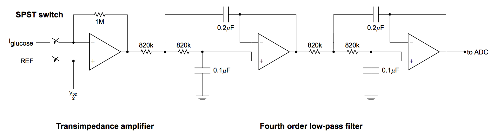

# Iontophoresis + Metabolite Board Documentation

## Table of Contents
1. [What's in here?](#what)
2. [How to use the board](#how)
3. [Differences from electrolyte board](#differences)

## What's in here? <div id='what'/>

This folder contains the board design and supporting information for ordring more copies of the iontohphoresis + metabolite sensing board. As the design of this board is nearly identical to that of the electrolyte board, I will only document the differences between this board and the electrolyte board, and suggest that you refer to the electrolyte board documentation for further information.

* **metabolite_eaglefiles** contains the Eagle CAD files for the metabolite board.
* **metabolyte_firmware_FINAL** contains the firmware for the metabolite board.
* **metabolite_orderfiles** contains all of the files needed to order a second run of the metabolite board. This folder contains Gerber files, as well as a centroids file and a Bill of Materials.
* **additional_datasheets** contains the datasheets for the components that differ from the electrolyte board

## How to use the board <div id='how'/>

### Supplying power

The board is powered off of a single 3.7V battery, or by a power supply with a minimum output voltage of around 3.5V. **Take care to not let the battery voltage fall too far, as one of the switching regulators on the board has the tendency to heat up a lot if its input voltage is too low.** The current draw on a 4V power supply should be around 0.1A.

Currently, the battery connector has wires soldered to the board. Green is for positive supply, blue is for ground.

### Connecting to Bluetooth

The board can be connected to using Bluetooth (both the GetBlue app and the custom app should work). The baud rate is 9600, and this cannot be changed. Data should be streaming out of the board as soon as a connection is made. The default pairing password for these Bluetooth modules is 1234.

**When trying to control the board using the GetBlue app, make sure that the output of GetBlue is hexadecimal.**

### Using Bluetooth commands

The board receives 8-bit commands over Bluetooth. The commands have format


The opcode determines what the command is, and the payload is a 4-bit number containing data. 

The board has two modes, sensing mode and current mode:

#### Sensing mode

In sensing mode, the board continuously dumps out sensor readings and current values in text string lines with the format

```
SensorCh1,SensorCh2,Current delivered,Current register
```

In this mode, the sensing switches are closed, enabling sensing, and the iontophoresis switches are open, for safety. The sensor readings are valid, the current delivered should be near zero, and current register should be exactly zero. The sensor readings are given in microamps (uA), and the current delivered reading is given in microamps (uA).

#### Current mode

In current mode, the board continuously dumps out current values and placeholders for sensor readings in the format

```
x,x,Current delivered,Current register
```

In this mode, the sensing switches are open, disabling sensing, and the iontophoresis switches are closed. The current delivered is proportional to the 8-bit current register value. The current delivered reading is given in microamps (uA).

#### Bluetooth command specifications

Name                                   |  Hex   | Function
:-------------------------------------:|:------:|:-------------------------:
DISABLE\_IONTOPHORESIS                 |  0x4   | Disables iontophoresis, puts the board back into sensing mode.
ENABLE\_IONTOPHORESIS\_INCREMENT\_BY   | 0x5    | Adds the payload bits to the iontophoresis PWM value. Has overflow protection. Puts the board into iontophoresis mode automatically.
ENABLE\_IONTOPHORESIS\_DECREMENT\_BY   | 0x6    | Subtracts the payload from the iontophoresis PWM value. Has underflow protection. Takes the board into sensing mode automatically if PWM value reaches 0.

### Which channel is which?

Looking down from the top, with components facing up:


## Differences from electrolyte board <div id='differences'/>

The sole difference between this board and the electrolyte board is the analog frontend. The frontend of the metabolite board consists of dual transimpedance amplifiers for current sensing. The op-amp used for the transimpedance amplifiers is the Analog Devices AD8642, chosen for its ultra-low input bias current. The schematic for the analog signal conditioning circuits is shown below:



The layout of the board is identical except for the analog first stage, and the firmware is nearly identical. The only notable difference is shown below:


